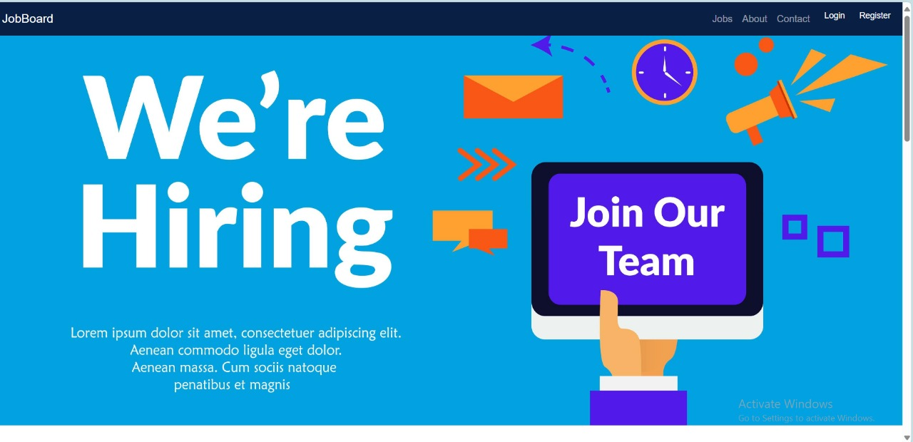
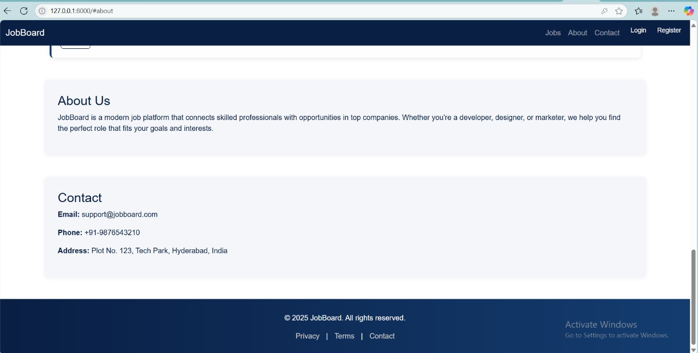

<<<<<<< HEAD
# 💼 JobBoard – Complete Job Listing Platform

**JobBoard** is a full-featured **frontend web application** that allows users to explore job listings, view job details, and register or log in via a modal popup interface. It fetches job data dynamically from a **Django REST API** secured with **JWT authentication**.

This platform is designed to be **clean, responsive, and modern**, using **HTML**, **CSS**, **Bootstrap 5**, and **JavaScript**. It’s a perfect base for connecting frontend job boards with any REST backend.

---

## 🔥 Project Highlights

### 🌐 Frontend Features
- **Sticky dark-blue navbar** with buttons for Login and Register
- **Responsive Bootstrap carousel** with job-related banners
- **Dynamic job listings** section using real-time API fetch
- **Stylish About & Contact sections**
- **Login/Register modal popup** with toggle logic
- **Clean footer** with links to privacy, terms, and contact

### 🧠 Core Concepts Covered
- HTML & Bootstrap layout
- Responsive UI and Carousel
- JavaScript DOM manipulation
- Fetching data using Fetch API
- JWT-based authorization
- Modal logic switching Login ↔ Register

---

## 🛠️ Technologies Used

| Category      | Tool/Library              |
|---------------|---------------------------|
| Frontend UI   | HTML5, CSS3               |
| CSS Framework | Bootstrap 5               |
| Logic         | JavaScript (Vanilla ES6)  |
| Data Fetching | Fetch API                 |
| Auth Format   | JWT Bearer Token          |
| Backend (Expected) | Django REST API      |

---

## ⚙️ API Integration

The project integrates with a **Django REST API** that returns a list of jobs. This API requires **JWT access token** for authentication.

### 🔐 Token Setup

In the script section of your HTML:
```js
const ACCESS_TOKEN = 'your_jwt_token_here';


📡 API Endpoints
1. Get All Jobs
bash
Copy code
GET /api/jobs/
Headers:

pgsql
Copy code
Authorization: Bearer <ACCESS_TOKEN>
Content-Type: application/json
Response:

json
Copy code
{
  "results": [
    {
      "id": 1,
      "title": "Frontend Developer",
      "location": "Hyderabad",
      "salary": 500000,
      "description": "We are looking for a passionate frontend developer...",
      "posted_on": "2025-07-09T18:30:00Z"
    }
    // More job objects
  ]
}
2. User Login (Expected API - Not implemented in frontend)
swift
Copy code
POST /api/auth/login/
Request Body:

json
Copy code
{
  "email": "user@example.com",
  "password": "password123"
}
Response:

json
Copy code
{
  "access_token": "jwt_access_token_here",
  "refresh_token": "jwt_refresh_token_here",
  "user": {
    "id": 1,
    "email": "user@example.com",
    "username": "username"
  }
}
3. User Registration (Expected API - Not implemented in frontend)
swift
Copy code
POST /api/auth/register/
Request Body:

json
Copy code
{
  "username": "newuser",
  "email": "newuser@example.com",
  "password": "password123",
  "confirm_password": "password123"
}
Response:

json
Copy code
{
  "message": "User registered successfully"
}
4. Apply for a Job (Optional, to implement)
bash
Copy code
POST /api/jobs/{job_id}/apply/
Headers:

makefile
Copy code
Authorization: Bearer <ACCESS_TOKEN>
Request Body:

json
Copy code
{
  "cover_letter": "I am excited to apply for this position..."
}
Response:

json
Copy code
{
  "message": "Application submitted successfully"
}
🖼️ Screenshots
Replace these placeholders with actual screenshots of your application pages.

1. Home Page with Carousel and Navbar
    

2. Job Listings Section
    

3. Login Modal Popup

4. Register Modal Popup
    

5. About Section

6. Contact Section
    

7. Footer

🖥️ How It Works (Step-by-Step)
User visits site and sees:

Carousel with images

Navigation bar with Jobs, About, Contact, Login/Register buttons

Job Listings are fetched from http://127.0.0.1:8000/api/jobs/ using JWT

Login/Register Modal is shown on button click

Modal title and fields toggle between login and register mode

About & Contact sections provide company info

Footer adds branding and legal links

🔧 Project Folder Structure (Single HTML File)
pgsql
Copy code
jobboard/
│
├── index.html       <-- Complete HTML + CSS + JS in one file
├── README.md
└── screenshots/     <-- Store your screenshot images here
(Optional separation for production)

pgsql
Copy code
jobboard/
├── index.html
├── script.js
├── style.css
├── README.md
└── screenshots/
💡 Future Scope / Enhancements
Implement full backend login/register API and frontend integration

Securely store JWT token in localStorage after login

Add job filters (by category, salary, location)

Add “Apply Now” form with backend integration

Pagination for job listings

Role-based dashboards (admin, recruiter, applicant)

🌐 Deployment
Recommended Hosting Platforms
GitHub Pages

Netlify

Vercel

Just drag and drop index.html or connect GitHub repo to host live.

🧑‍💻 Author
Pavani Pitti Oruganti
🎓 B.Tech 4th Year – Artificial Intelligence & Data Science
💻 Aspiring Full Stack Developer | Passionate about Web & API Projects

📜 License
This project is open-source and free for learning or portfolio use.

yaml
Copy code

---

If you want, I can also help generate a ZIP file with the project and placeholder images folder for screenshots.

Would you like that?
=======
# jobboard
>>>>>>> 9f5afe5fc251a739836f2f7fd374c27db6af0b18
